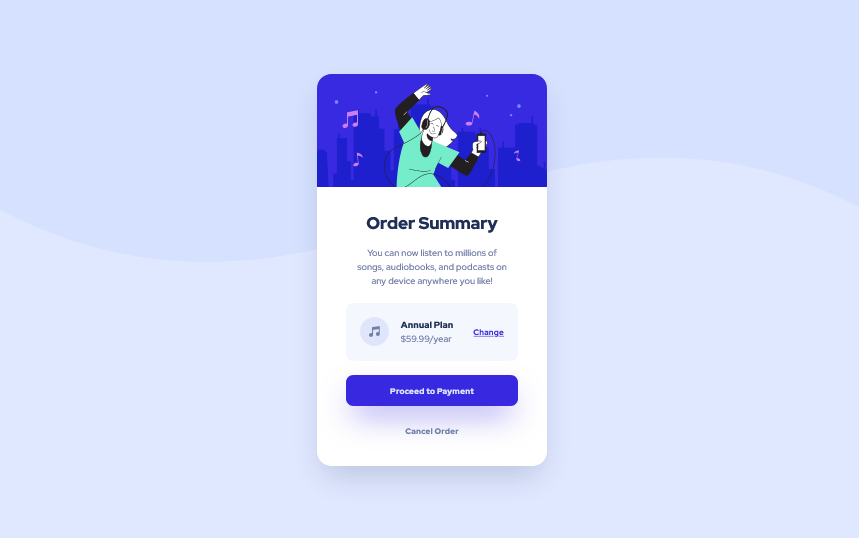

# Frontend Mentor - Order summary card solution

This is a solution to the [Order summary card challenge on Frontend Mentor](https://www.frontendmentor.io/challenges/order-summary-component-QlPmajDUj). Frontend Mentor challenges help you improve your coding skills by building realistic projects. 

## Table of contents

- [Overview](#overview)
  - [The challenge](#the-challenge)
  - [Screenshot](#screenshot)
  - [Links](#links)
- [My process](#my-process)
  - [Built with](#built-with)
  - [What I learned](#what-i-learned)
  - [Continued development](#continued-development)
  - [Useful resources](#useful-resources)
- [Author](#author)

## Overview

### The challenge

Users should be able to:

- See hover states for interactive elements

### Screenshot



### Links

- [Solution](https://www.frontendmentor.io/solutions/order-summary-component-tailwindcss-P_Z8NrErPV)
- [Live site](https://stephenyu2018.github.io/order-summary-component-main/)

## My process

### Built with

- Semantic HTML5 markup
- CSS custom properties
- Flexbox
- Mobile-first workflow
- [TailwindCSS](https://tailwindcss.com/) - CSS Utility Framework

### What I learned

I learned how to use hover states and screen breakpoints to conditionally 
apply styles. TailwindCSS makes it easy to add those styles to the HTML 
class names, which sets it apart from inline styles. 

For example, the CTA button to "Proceed to Payment" is styled accordingly:

```html
<button class="bg-bright-blue hover:bg-active-bright-blue ...">
  Proceed to Payment
</button>
```

When the user hovers the mouse over the button, it becomes a brighter blue.
When the user's mouse is not over the button, it defaults to the bright blue
provided in the style guide.

I also learned about a convenient way to equally space multiple child 
elements apart:

```html
<div class="... space-x-5">
          
  

  <div class="... sm:space-y-1">
    <h1 class="...">Annual Plan</h1>
    <p class="...">$59.99/year</p>
  </div>

  <button class="...">Change</button>
</div>
```

By using `space-x-5`, the ``, `<div>`, `<button>` child elements are 
spaced equally along the horizontal axis. The `<div>` child element also uses 
`sm:space-y-1` to add some spacing between texts along the vertical axis on 
screen sizes larger than small.

Finally, I learned the differences between box shadows & drop shadows. Box 
shadows follow the box model, meaning the shadow will always form a rectangle, 
even when the element was styled to be a different shape. A drop shadow is a 
CSS filter that will apply the shadow based on its shape. However, either CSS 
or TailwindCSS doesn't provide a way to change a drop shadow's color, which 
is different from box shadows. 

### Continued development

Despite my best efforts, I ended up not implementing fluid layouts to work 
with my responsive design. I wanted the component to scale properly for 
differing screen resolutions, as the current look makes the component take up 
most of the page height. However, I found out that the CSS functions `min()`, 
`max()`, `minmax()` & `clamp()` don't work with TailwindCSS, even when using 
it as an arbitrary value. 

My next best option was using screen breakpoints in its place. However, this 
meant I had to find ways to calculate each CSS property I wanted to make 
fluid. It definitely didn't help that `calc()` also was not working with the 
framework. So I would've ended up with many different values that doesn't 
show how I got them. It just wasn't worth the effort for this project

### Useful resources

- [TailwindCSS Docs - Space Between](https://tailwindcss.com/docs/space) - Helped me find a consistent way to space child elements apart from each other
- [Breaking down CSS Box Shadow vs. Drop Shadow](https://css-tricks.com/breaking-css-box-shadow-vs-drop-shadow/) - Helped me choose box shadows since its color is customizable

## Author

Frontend Mentor - [@StephenYu2018](https://www.frontendmentor.io/profile/StephenYu2018)
